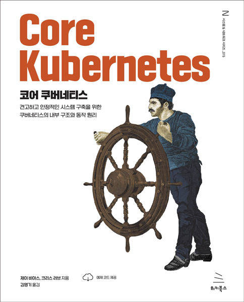

# 코어 쿠버네티스
### 견고하고 안정적인 시스템 구축을 쿠버네티스의 내부 구조와 동작 원리

- **제이 비아스, 크리스 러브** 지음 | **김영기** 옮김
- ISBN: 9791158393946
- 판형: 188*240*16mm
- 28,000원 | 2023년 7월 28일 발행 | 392쪽
- [책 홈페이지](https://wikibook.co.kr/corek8s/)
- [도서 미리보기](http://www.yes24.com/Product/Viewer/Preview/120763051)
- [도서 관련 문의](https://wikibook.co.kr/support/contact/)

---

**쿠버네티스의 핵심 사항을 이해하려면 반드시 이 책을 읽어 보자!**

현실에서 쿠버네티스의 배포는 힘든 작업입니다. 작은 구성 오류나 설계 문제도 시스템을 망칠 수 있습니다. 현실에서 신속하게 문제를 해결하고, 구성을 재설정하고, 다음 문제로 넘어가려면 각 컴포넌트의 동작 방법을 아는 것은 중요합니다. 이 독특한 책은 쿠버네티스 앱을 계속 운영하기 위한 세부사항과 힘들게 얻은 노하우, 전문가들의 팁을 포함하고 있습니다.

이 책은 iptables 관리부터 부하에 따라 동적으로 확장되는 클러스터 설정까지, 쿠버네티스의 내부를 살펴봅니다. 이 책의 모든 페이지는 쿠버네티스 설정과 관리, 불가피한 껄끄러운 상황을 다루기 위한 새로운 통찰력을 제공합니다. 《코어 쿠버네티스》는 운영 환경에서 쿠버네티스 배포를 관리하기 위한 포괄적인 참조 가이드입니다.

**★ 이 책에서 다루는 내용 ★**

- 쿠버네티스의 기본 컴포넌트
- 스토리지와 컨테이너 스토리지 인터페이스
- 쿠버네티스 보안
- 쿠버네티스 클러스터를 생성하는 다양한 방법
- 컨트롤 플레인, 네트워킹, 기타 핵심 컴포넌트에 대한 세부사항

---
 
 ## 구입처
 
 - [예스24](http://www.yes24.com/Product/Goods/120763051)
 - [교보문고](https://product.kyobobook.co.kr/detail/S000203332747)
 - [인터파크](http://book.interpark.com/product/BookDisplay.do?_method=detail&sc.prdNo=356775226)
 - [알라딘](https://www.aladin.co.kr/shop/wproduct.aspx?ItemId=321317122)